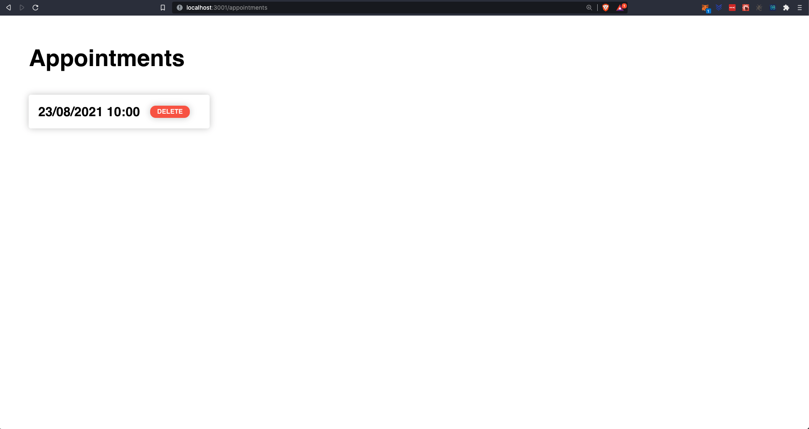

# Getting Started with Create React App

This project was bootstrapped with [Create React App](https://github.com/facebook/create-react-app).

## Available Scripts

In order to run this project you need to start the backend (https://github.com/Jonathansoufer/room-mgnt-api) first.

Then you can initialize the project with:

### `yarn start`

Runs the app in the development mode.\
Open [http://localhost:3001](http://localhost:3001) to view it in the browser.

The page will reload if you make edits.\
You will also see any lint errors in the console.

### Some screenshots of the app

